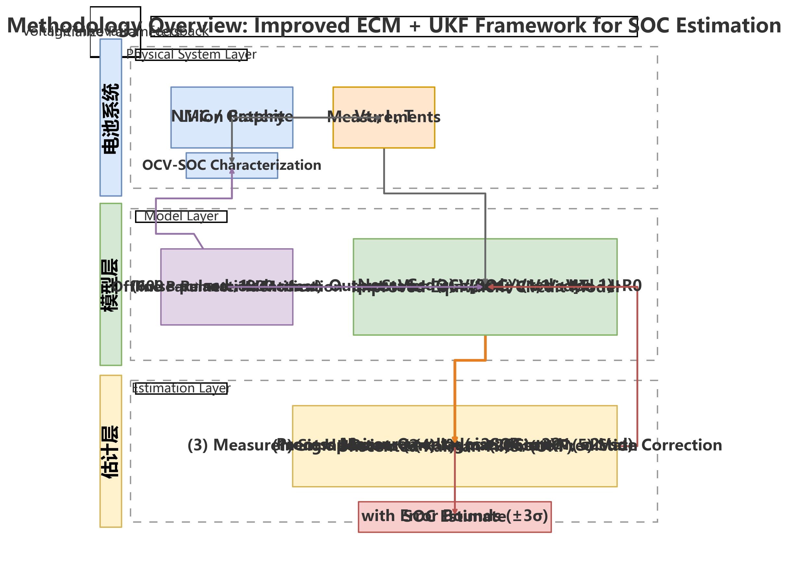
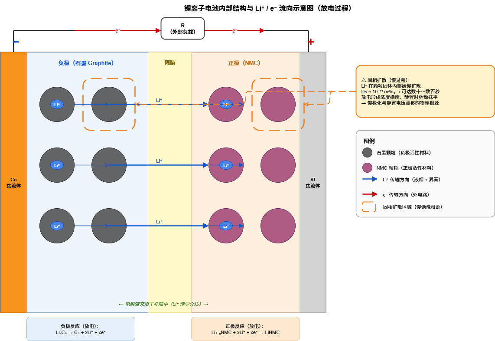
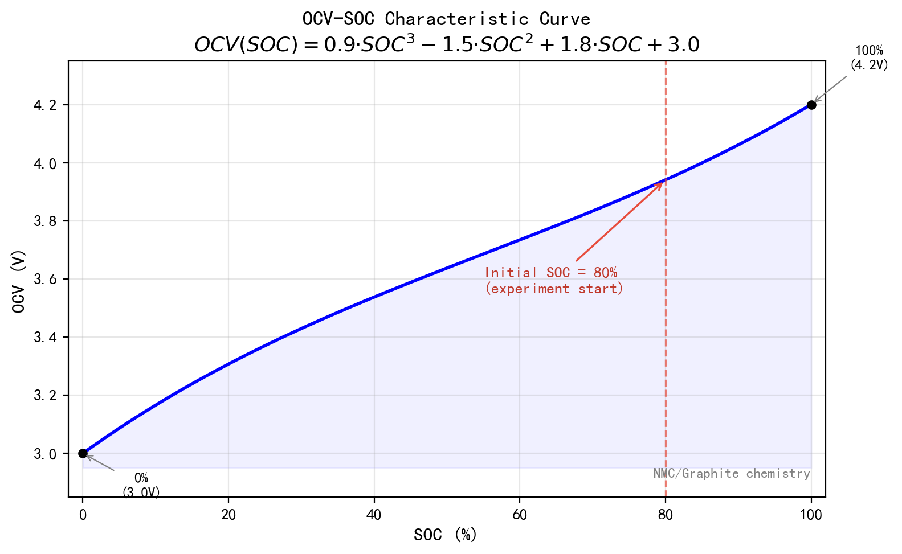
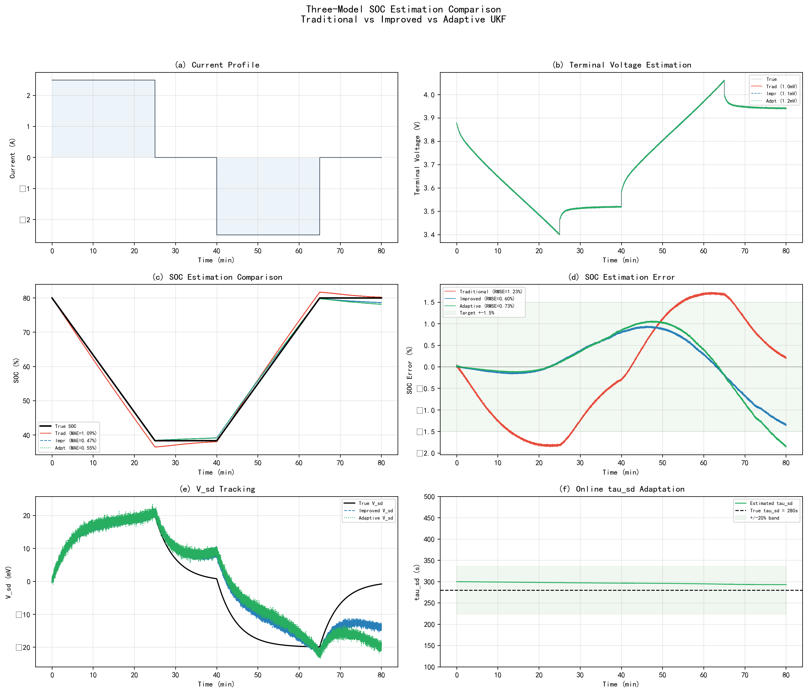
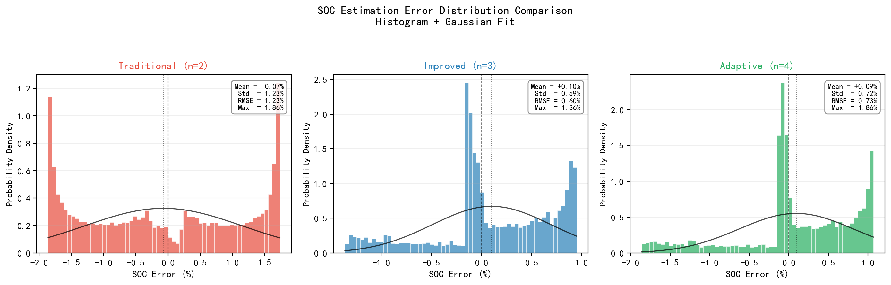
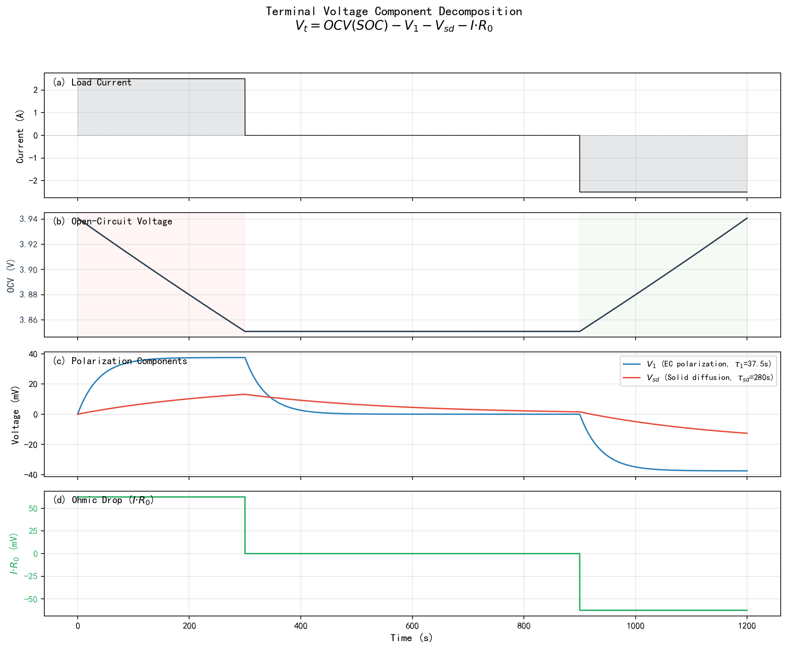
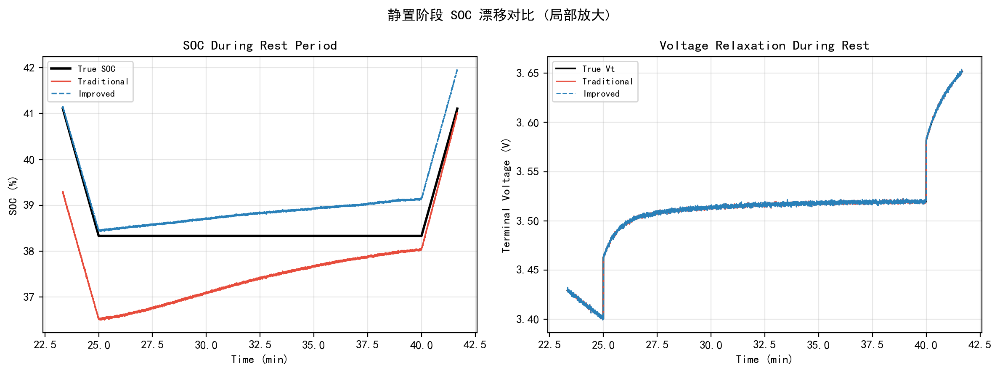
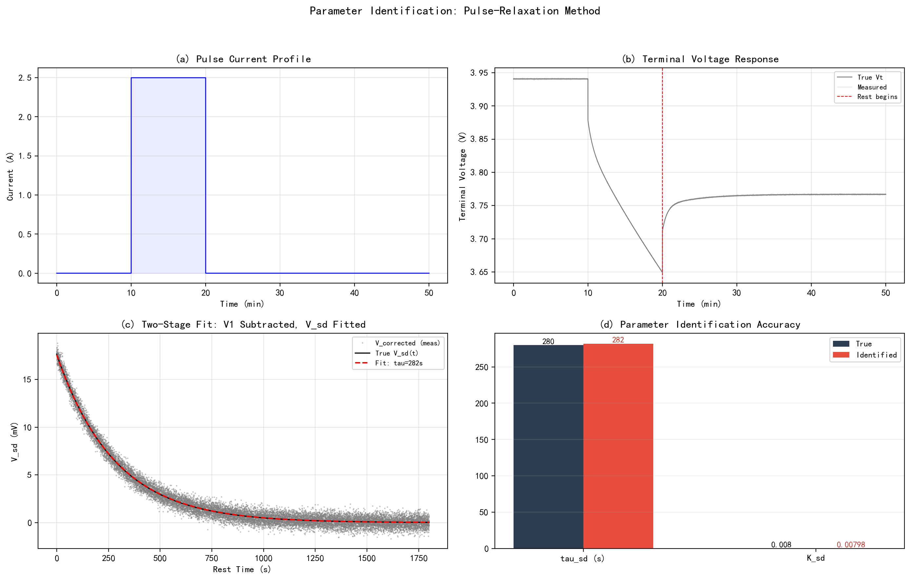

# SDR-SOC-Estimator

**固相扩散慢弛豫修正的锂离子电池 SOC 高精度估计**

*Solid-Phase Diffusion Relaxation Corrected ECM + UKF for High-Accuracy Li-ion Battery SOC Estimation*

[](https://www.python.org/)

---

## 概述

传统一阶 RC 等效电路模型用单一 RC 支路同时表征快极化（电化学极化）与慢扩散（固相浓差极化），静置阶段端电压预测存在系统性偏差，导致 SOC 估计精度不足。

本项目提出一种**轻量化改进方案**：引入一阶惯性环节 **G<sub>sd</sub>(s) = K<sub>sd</sub> / (τ<sub>sd</sub> · s + 1)** 作为固相扩散修正项，仅增加 2 个可辨识参数（τ<sub>sd</sub>、K<sub>sd</sub>），在不增加模型阶数的前提下实现快慢动力学的解耦表征，结合无迹卡尔曼滤波（UKF）实现高精度 SOC 估计。

| 指标 | 传统模型 | 改进模型 | 降幅 |
|------|:-------:|:-------:|:----:|
| RMSE | 1.23% | **0.60%** | 50.9% |
| 最大误差 | 1.86% | **1.36%** | 26.7% |
| 平均误差 | 1.09% | **0.48%** | 56.6% |

---

## 方法论框架



整体框架分为三层：
- **物理系统层**：Li-ion 电池（NMC/石墨）+ 端电压 V<sub>t</sub>、电流 I、温度 T 测量
- **模型层**：改进 ECM（含固相扩散修正项 V<sub>sd</sub>）+ 脉冲-静置参数离线辨识
- **估计层**：UKF 状态估计 + 电压新息反馈闭环

---

## 电池内部结构与固相扩散机理



正极（NMC）、负极（石墨）、隔膜、电解液。放电时 Li⁺ 从负极石墨层间脱嵌，经电解液穿过隔膜嵌入正极 NMC 晶格，电子经外电路由负极流向正极。

Li⁺ 在电极颗粒内部的**固相扩散系数** D<sub>s</sub> ≈ 10⁻¹¹ ~ 10⁻¹³ cm²/s，远小于液相扩散系数 D<sub>e</sub> ≈ 10⁻⁵ ~ 10⁻⁶ cm²/s，弛豫时间 τ<sub>sd</sub> ≈ 100 ~ 1000 s，是电池动力学的限速步骤——即"**固相扩散慢弛豫**"的物理来源。该慢过程的准确表征是 SOC 估计精度的关键挑战。

---

## 改进等效电路模型

### 模型对比

| | 传统一阶 RC | **改进模型（本文）** |
|------|:-----------:|:-------------------:|
| RC 支路数 | 1 | 1（不变） |
| 状态维数 | 2 | 3 |
| 新增参数 | — | τ<sub>sd</sub>、K<sub>sd</sub>（2 个） |
| 快极化 | RC（τ₁ ≈ 37.5 s） | RC（τ₁ ≈ 37.5 s） |
| 慢扩散 | 混入 RC 支路 | 独立惯性环节（τ<sub>sd</sub> ≈ 280 s） |

### 状态方程

```
状态向量:  x = [SOC, V₁, Vₛₔ]ᵀ

SOC(k+1)  = SOC(k) − Δt · I(k) / Qₙ
V₁(k+1)   = V₁(k) · exp(−Δt/τ₁)   + I(k) · R₁ · (1 − exp(−Δt/τ₁))
Vₛₔ(k+1)  = Vₛₔ(k) · exp(−Δt/τₛₔ) + I(k) · Kₛₔ · (1 − exp(−Δt/τₛₔ))
```

### 观测方程

```
Vₜ = OCV(SOC) − V₁ − Vₛₔ − I · R₀
```

> V₁ 表征电化学极化快动态（τ₁ ≈ 37.5 s），V<sub>sd</sub> 独立表征固相扩散慢弛豫（τ<sub>sd</sub> ≈ 280 s），实现两种动力学的**解耦**。

---

## OCV-SOC 特性曲线



NMC/石墨体系，三阶多项式拟合（3.0 ~ 4.2 V）：

```
OCV(SOC) = 0.9·SOC³ − 1.5·SOC² + 1.8·SOC + 3.0
```

---

## 仿真结果

### 工况设计

1C 恒流放电 1500 s → 静置 900 s → 1C 恒流充电 1500 s → 静置 900 s，覆盖充放电快响应与静置慢弛豫过程。

### 三模型 SOC 估计综合对比



三组对比模型：(a) 传统一阶 RC + UKF（n = 2）、(b) **改进模型 + UKF（n = 3）**、(c) 自适应模型 + UKF（τ<sub>sd</sub> 在线估计，n = 4）。

### SOC 估计误差分布



改进模型误差集中在 ±0.5% 以内，传统模型分散至 ±2%。改进模型误差分布的均值更接近零、方差更小。

### 端电压分量分解



端电压各分量独立贡献清晰可见：V<sub>t</sub> = OCV − V₁ − V<sub>sd</sub> − I·R₀。V<sub>sd</sub> 幅值（~20 mV）虽小于 V₁（~37.5 mV）和 I·R₀（~62.5 mV），但因其 τ<sub>sd</sub>（280 s）远超 τ₁（37.5 s），在静置阶段累积效应显著。

### 静置阶段 SOC 漂移抑制



放电结束后 900 s 静置期间：传统模型因缺少 V<sub>sd</sub> 衰减机制，将电压回升错误映射为 SOC 变化，导致估计偏离 1.5% ~ 2%；改进模型通过 V<sub>sd</sub> 独立追踪慢弛豫，SOC 误差**控制在 0.3% 以内**。

### 参数离线辨识



脉冲-静置两阶段辨识方法——600 s 脉冲 + 1800 s 静置：

| 参数 | 真值 | 辨识值 | 误差 |
|------|:----:|:-----:|:----:|
| τ<sub>sd</sub> (s) | 280.0 | 282.1 | 0.7% |
| K<sub>sd</sub> | 0.0080 | 0.0080 | 0.2% |

---

## 项目结构

```
battery_soc/
├── main.py                        # 主仿真脚本（三模型 SOC 对比）
├── ukf.py                         # UKF 估计器（支持 n = 2/3/4 三种模型）
├── parameters.py                  # 电池参数、OCV-SOC 曲线、工况电流
├── param_identify.py              # 脉冲-静置参数离线辨识
├── run_p0.py                      # P0 精度验证
├── generate_paper.py              # Word 论文自动生成（python-docx + OMML 原生公式）
├── generate_methodology_fig.py    # 方法论框架图生成
├── generate_extra_figures.py      # 辅助图表生成
├── render_drawio.py               # Draw.io XML → PNG 渲染
├── fig_methodology.drawio.xml     # 方法论框架图源文件（Draw.io 可编辑格式）
├── fig_methodology.png            # 方法论框架图
├── fig_battery_structure.png      # 电池内部结构示意图
├── fig_ocv_soc.png                # OCV-SOC 特性曲线
├── three_way_comparison.png       # 三模型综合对比
├── fig_error_distribution.png     # 误差分布对比
├── fig_voltage_decomposition.png  # 端电压分量分解
├── rest_period_detail.png         # 静置阶段 SOC 漂移抑制
├── param_identification.png       # 参数辨识可视化
└── literature/                    # 参考文献
```

---

## 快速开始

### 环境

```bash
pip install numpy matplotlib scipy python-docx lxml
```

### 运行仿真

```bash
python main.py                    # 三模型 SOC 估计对比（主仿真）
python param_identify.py          # 脉冲-静置参数离线辨识
python run_p0.py                  # 精度验证
```

---

## 作者

**彭振翔** — 西南交通大学 环境工程学院

---

## 许可证

MIT License
